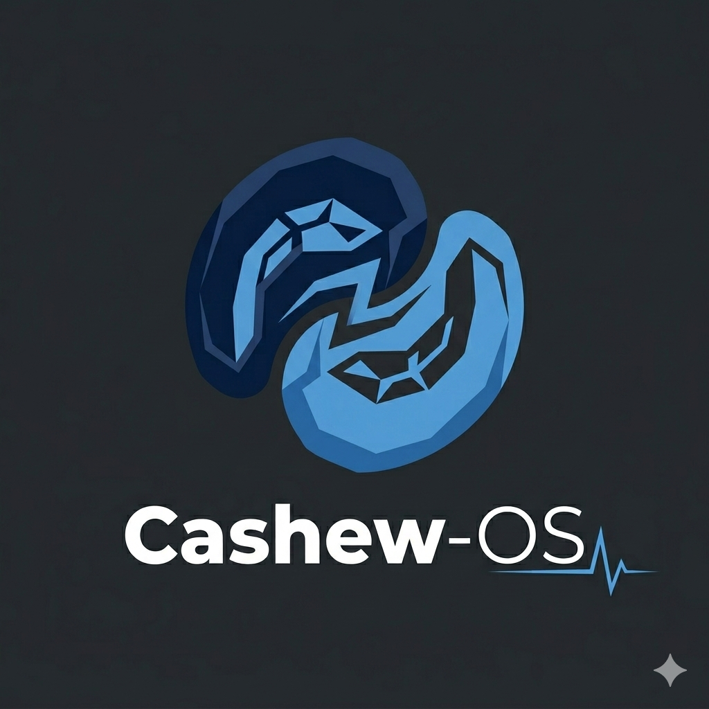

<p align="center">
  
</p>

* * *

[](https://github.com/pulsadenura/cashew-os/actions/workflows/build.yml)
---
# Cashew-OS

an opinionated, cloud-native desktop designed to solve the "Laptop Paradox": providing a full-featured development environment without sacrificing battery longevity. By stripping away the background noise of traditional desktops and enforcing deep hardware-level power policies, we’ve created a system that stays cool, quiet, and alive longer than standard distributions.
Built on top on [universal-blue's](https://universal-blue.org/) and [Wayblue](https://github.com/wayblueorg/wayblue) using [blueBuild](https://blue-build.org/)

# Core Principles

  - Immutability by Default: Powered by bootc and ostree. Your OS is a read-only appliance that never "drifts" or breaks over time.

  - Wayland-First Architecture: No X11 legacy bloat. Every pixel is rendered natively for maximum GPU efficiency.

  - Intel Optimized: Specifically tuned for modern Intel i-series silicon, utilizing specialized thermal and power drivers.

  - The "Invisible" Desktop: A Tiling Window Manager (Sway) workflow that maximizes screen real estate and minimizes CPU wakeups.
  
  - Set up nicely by default: comes preinstalled with [Autotiling](https://github.com/nwg-piotr/autotiling) and with a modified swaybar configuration, alongside several hand picked applications so you can get going straight away.


* * *

## 🧬 The Lineage tree

Cashew-OS isn't built from scratch; it is a specialized "descendant" in the Fedora Atomic ecosystem. Understanding the base helps explain why this system is so stable:

1.  **Cashew-OS:** Our final layer. We take the lean Wayblue base and inject aggressive power-management scripts and hardware-specific optimizations. alongside sensible default apps and settings that i felt were missing, this aims to be a complete starter package you dont need to worry about.
    
2.  **Wayblue:** Wayblue is a community-maintained project built on top of the universal Blue framework. Being focused on Wayland and Tiling Window Managers (like Sway, Hyprland, or Wayfire) instead of big Desktop Environments like GNOME or KDE to create a "pure" Wayland.
    
3.  **Universal Blue:** Universal Blue is community project and a manufacturing process that applies "Cloud Native" principles to the Linux desktop. they also maintain a set of base images built from Fedora Atomic Desktops and then enhanced with additional hardware support and fixes. A community layer that adds "batteries included" features like better hardware sensing, codecs, and container toolkits.

4.  **Fedora Sway Atomic:** The Bedrockof this project, It provides the immutable **ostree** core and *bootc*, ensuring your system never breaks during an update and can always revert to a "known good" state.
    

* * *

## 🔋 Why it Lasts Longer

Most distributions are designed for desktops—they assume you are plugged into a wall. Cashew-OS assumes you are at a coffee shop with 15% remaining.

### 1\. The Wayland + Sway Advantage

Traditional desktops (GNOME/KDE) run dozens of background processes just to keep the UI pretty. By using **Sway** (a tiling Wayland compositor), we achieve:

-   **Zero Background "Bling":** No blur, no heavy shadows, and no complex animations that wake up the GPU.
    
-   **Efficient Rendering:** Wayland’s "every frame is perfect" architecture means the GPU only works when something actually changes on the screen.
    
-   **Tiling Efficiency:** Since windows are tiled by default, the compositor doesn't have to calculate overlapping "z-indexes" or hidden window states.
  
**Wayland is also more battery efficient compared to X11 - [article](https://www.phoronix.com/news/KDE-Plasma-Wayland-Power)**

### 2\. Deep Hardware Tuning

We don't just hope the kernel saves power; we force it.

-   **Powertop --auto-tune:** Our baseline includes a systemd service that triggers aggressive power-saving on every boot. This forces USB controllers, SATA links, and PCI buses into "autosuspend" mode when idle.
    
-   **Thermald:** Specifically tuned for Intel chips to prevent "thermal runaway," keeping the laptop cool so the fans (which draw significant power) stay off.
    
-   **Fast-Storage (zRAM):** We utilize **Zstd** compression in RAM. By swapping to compressed memory instead of the SSD, we prevent the disk from "waking up" to write data, saving both battery and wear-and-tear.
    
- **Integrated Microcode Patches**: Automatically includes microcode_ctl to ensure your Intel CPU is running the latest stability and power efficiency fixes from the factory.

- **Native Video Offloading**: Pre-configured VA-API and Intel-media-driver layers ensure that 4K video playback is handled by the GPU's fixed-function hardware, not the power-hungry CPU cores.

* * *
# Hardened Foundations

**Cashew-OS integrates more secure defaults, based on [Tenable's audits](https://www.tenable.com/audits/CIS_Fedora_28_Family_Linux_Workstation_L1_v2.0.0)**

    Network:

        MAC Randomization: Your Wi-Fi and Ethernet hardware IDs are randomized on every connection, preventing physical tracking across networks.

        DNS-over-TLS (DoT): All DNS queries are encrypted via Cloudflare and Quad9, hiding your browsing history from your ISP.

        NTS (Network Time Security): Encrypted time synchronization prevents Man-in-the-Middle (MITM) attacks on your system clock using cloudflares NTP server.

    Kernel & Memory Protection:

        Attack Surface Reduction: Obsolete kernel modules (Floppy, Firewire, etc.) and obscure networking protocols (SCTP, DCCP) are blacklisted by default.

        Coredump Disabling: Prevents sensitive RAM data from being written to disk if an application crashes.

        Sysctl Hardening: Optimized kernel parameters to ignore malicious ICMP redirects and prevent IP spoofing via Reverse Path Filtering.

    Advanced Authentication:

        Brute-Force Protection: Accounts are locked for 24 hours after 50 failed login attempts.

        Hardened Hashing: Passwords use the yescrypt algorithm with a high cost factor, making offline "cracking" exponentially more difficult.

* * * 

## 🛠️ Tooling

We chose tools that are Wayland-Native and Qt6-optimized. These apps talk directly to the compositor without middle-man translation layers (XWayland), significantly saving CPU cycles and extending battery life:

  Terminal: `foot` — An incredibly fast, lightweight terminal emulator with a "server-client" mode to minimize memory footprint.

  Editor: `Kate` — High-efficiency text editing and "Lite-IDE" features without the bloat of Electron-based editors.

  Browser: `Waterfox` — A speed-focused Firefox fork managed via Flatpak to keep the system core clean.

  File Manager: `PCManFM-Qt` — A lightning-fast, native Qt6 file manager that handles the "Invisible Desktop" logic.

  Audio: `Qmmp` — The ultimate Winamp-style outlier for high-performance audio, utilizing a pure Qt6 interface.

  Video: `mpv` — Best-in-class, minimalist media player with native Wayland support.

  Image Viewer: `qView` — A minimalist, "no-UI" image viewer designed to be seen only when you need it.

  System Monitor: qps — A visual process manager that provides deep system insights with a tiny footprint.

---

  **Utilities**:  
  `Luminance` for hardware brightness control.

  `Bazaar` for a clean Flatpak management interface.

  `CopyQ` for advanced, scriptable clipboard management.

  `Podman-Desktop` & `Kontainer` for specialized container orchestration.
* * *
## Installation

To rebase an existing atomic Fedora installation to the latest build:

- First rebase to the unsigned image, to get the proper signing keys and policies installed:
  ```
  rpm-ostree rebase ostree-unverified-registry:ghcr.io/pulsadenura/cashew-os:latest
  ```
- Reboot to complete the rebase:
  ```
  systemctl reboot
  ```
- Then rebase to the signed image, like so:
  ```
  rpm-ostree rebase ostree-image-signed:docker://ghcr.io/pulsadenura/cashew-os:latest
  ```
- Reboot again to complete the installation
  ```
  systemctl reboot
  ```

The `latest` tag will automatically point to the latest build. That build will still always use the Fedora version specified in `recipe.yml`, so you won't get accidentally updated to the next major version.

## Verification

These images are signed with [Sigstore](https://www.sigstore.dev/)'s [cosign](https://github.com/sigstore/cosign). You can verify the signature by downloading the `cosign.pub` file from this repo and running the following command:

```bash
cosign verify --key cosign.pub ghcr.io/pulsadenura/cashew-os
```
